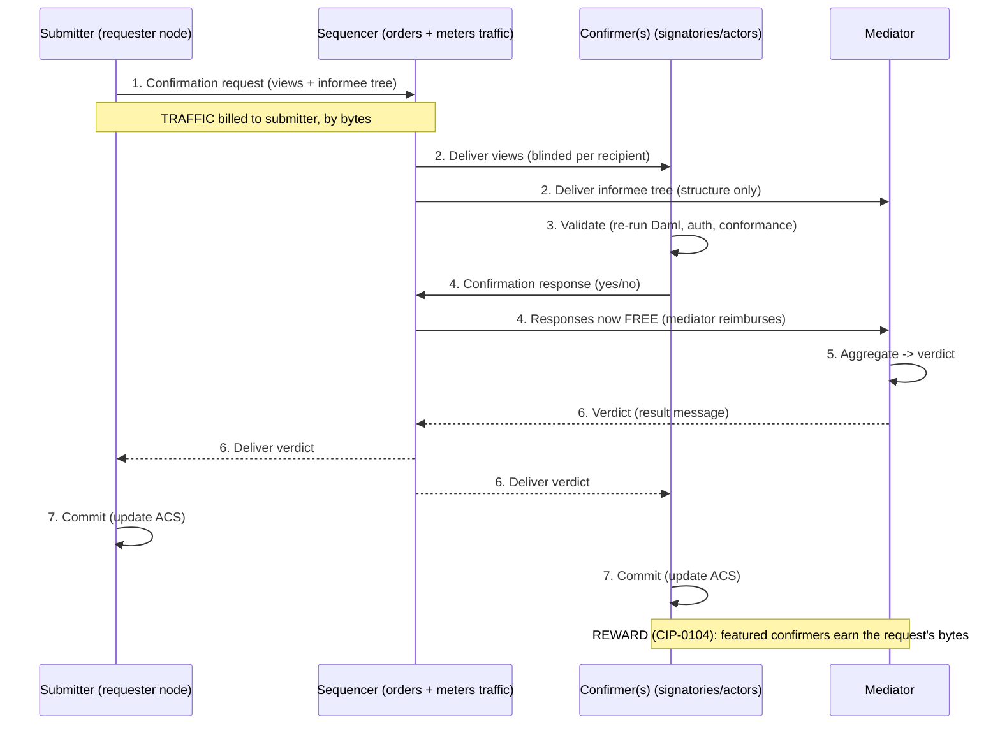

# Canton transaction flow & traffic fees

> Companion to [`featured-app-rewards.md`](./featured-app-rewards.md). Explains how a Canton
> transaction is processed end to end, who is charged synchronizer traffic, who earns app
> rewards, and how to estimate the Canton Coin cost of a submission. This is the protocol
> grounding for the **"submitter pays, confirmer earns"** principle that drives the reward
> strategy. Verified against the sources in [References](#references).

## TL;DR

- A transaction is split into **views**; each participant sees only the views it is an
  informee of (everything else is blinded). This is Canton's privacy model.
- The **submitting participant** broadcasts a **confirmation request** through the
  **sequencer**; the **confirming participants** (those hosting signatories / acting
  parties) validate and send **confirmation responses** to the **mediator**; the mediator
  aggregates them into one **verdict**; on a positive verdict every informee commits.
- **Traffic** (the synchronizer's metered resource, paid by burning Canton Coin) is charged
  **by bytes to the submitting validator node** for the confirmation request. Since CIP-0104,
  confirmation **responses are free** (the mediator reimburses them).
- **App rewards** (CIP-0104) for that traffic go to the **featured app parties that are
  confirmers** of the views — not the submitter, not observers. So **the payer and the earner
  are different roles by design**.
- At low volume a submission is often **effectively free** — it fits inside the free base-rate
  burst (~400 KB / 20 min). The `extraTrafficPrice` only bites above that.

## 1. The players (topology)

```text
SYNCHRONIZER  (sequencer + mediator + topology manager; the "domain" in Canton 2.x)

+-------------------+   +-------------------+   +-------------------+
|     SEQUENCER     |   |      MEDIATOR     |   |   TOPOLOGY MGR    |
| orders & relays   |   | collects yes/no   |   | parties, keys,    |
| EVERY message;    |   | votes -> 1        |   | permissions       |
| meters TRAFFIC    |   | verdict; sees     |   |                   |
| (by bytes)        |   | structure only    |   |                   |
+-------------------+   +-------------------+   +-------------------+

        ^  every message crosses the sequencer (the bus)  ^
        |                                                  |
+-------------------+   +-------------------+   +-------------------+
|    PARTICIPANT    |   |    PARTICIPANT    |   |    PARTICIPANT    |
|    (requester)    |   |    (operators)    |   |    (sigNetwork)   |
| hosts parties;    |   | hosts parties;    |   | hosts parties;    |
| own private       |   | own private       |   | own private       |
| ledger (ACS)      |   | ledger (ACS)      |   | ledger (ACS)      |
+-------------------+   +-------------------+   +-------------------+
```

`sequencer + mediator + topology manager = the synchronizer`. Participants are the only nodes
that hold contract data and keep a private ledger (the ACS). The synchronizer orders messages
and proves agreement **without seeing contract contents** — the mediator sees only the
_structure_ (which parties confirm which views), never the payload.

## 2. One transaction, end to end

```text
  SUBMITTER             SEQUENCER             CONFIRMER(s)          MEDIATOR
  (requester node)      (orders every msg     (signatories /        (aggregates the
                         + meters traffic)     acting parties)        votes -> verdict)
  |                     |                     |                     |
  | (1) confirmation request: tx split into VIEWS (blinded per      |
  |     recipient) + an informee tree                               |
  |-------------------->|                     |                     |
  |   [TRAFFIC billed   |--- deliver views -->|                     |
  |    to submitter,    |                     |                     |
  |    by bytes]        |--- informee tree (structure only) ------->|
  |                     |                     |                     |
  |                     |          (2) validate views: re-run       |
  |                     |              Daml, check authorization     |
  |                     |              + model conformance           |
  |                     |                     |                     |
  |                     |<-- (3) confirmation response (yes/no) -----|
  |                     |    [now FREE: mediator reimburses          |
  |                     |     the confirmer's node]                  |
  |                     |                     |   (4) aggregate ->   |
  |                     |                     |       VERDICT        |
  |<----- (5) verdict (result message) delivered to all informees --|
  |                     |                     |                     |
  | (6) commit:         |                     | (6) commit:         |
  |     update ACS      |                     |     update ACS      |
  |                     |                     |                     |
  +=== REWARD (CIP-0104): featured CONFIRMERS earn the request's bytes ===+
```

The six stages: **Submission -> Sequencing -> Validation -> Confirmation -> Mediation
(verdict) -> Commit.** Two facts carry the whole reward story: the **traffic meter fires at
(1)** on the submitter, and the **reward at the bottom attaches to the confirmers** of those
same views.

Rendered version (GitHub / IDE will draw this):



## 3. Submitter pays, confirmer earns

Because billing attaches to the **submitting node** and rewards attach to the **featured
confirming party**, the two can be — and ideally are — different entities. CIP-0104 verbatim:

> "The sequencer continues to charge the traffic cost of a submission to the submitting
> validator node."

> "the traffic cost of a successful confirmation request is granted to the app provider
> parties proportional to the envelope sizes of the envelopes on which they appear as
> confirmers."

A **confirmer** is a party whose node "must validate the view and send a positive confirmation
response" — i.e. a **signatory of a created contract, or a signatory / acting party of an
exercised contract**. Contract and choice **observers do not confirm and earn nothing**. To
actually earn, a confirmer must _also_ hold an active `FeaturedAppRight` at round start; and if
several featured parties confirm the same envelope, the weight is split by `num_app_confirmers`.

Three cases follow:

- **Case 1 — you submit and confirm (and are featured):** you pay the request traffic _and_
  earn the reward. Net = reward - cost. _(This is Signet's evidence templates.)_
- **Case 2 — someone else submits, you confirm (featured):** they pay, you earn. Pure upside —
  the prize. _(This is what co-signing the value layer would unlock for Signet.)_
- **Case 3 — you submit but are not a featured confirmer (or only an observer):** you pay and
  earn nothing. _(Avoid being here.)_

The strategy reduces to: **be a featured confirmer on byte-heavy transactions that other
parties submit and pay for** (Case 2), and never be the lone payer who is not a confirmer
(Case 3).

## 4. Estimating the price of a submission

The only app-facing cost is the confirmation request at step (1) — responses are free and the
verdict is synchronizer infrastructure. The computation:

```text
effective_bytes = payload_bytes * (1 + recipients * readVsWriteScalingFactor/10000)
billable_bytes  = max(0, effective_bytes - free_allowance_remaining)
usd_cost        = (billable_bytes / 1e6) * extraTrafficPrice    # extraTrafficPrice is USD per MB
cc_burned       = usd_cost converted at amuletPrice (current OpenMiningRound)
```

| Parameter (`SynchronizerFeesConfig`) | Role                    | Value / units (per docs)            |
| ------------------------------------ | ----------------------- | ----------------------------------- |
| `readVsWriteScalingFactor`           | per-recipient surcharge | ~0.004 / recipient (10 recip = +4%) |
| `baseRateTrafficLimits.burstAmount`  | free allowance          | ~400,000 bytes                      |
| `baseRateTrafficLimits.burstWindow`  | free-tier window        | 1,200,000,000 us = 20 min           |
| `extraTrafficPrice`                  | overage price           | USD per MB                          |
| `amuletPrice` (`OpenMiningRound`)    | USD <-> CC rate         | SV median-voted, per round          |
| `minTopupAmount`                     | minimum traffic buy     | bytes                               |

Docs' worked unit: _"a 1 MB message with 10 recipients draws `1,000,000 * (1 + 10*0.004) =
1,040,000` bytes."_ Validators top up automatically by burning CC, recorded on `MemberTraffic`
contracts; the USD price is charged in CC at the current `OpenMiningRound` amulet price.

**The free-tier insight (matters most for the subsidy question).** The base rate is
**~400 KB per 20 min (~333 bytes/sec sustained)**. A Signet evidence transaction is only a few
KB, so **below ~50 evidence txs per 20-minute window the marginal traffic cost is effectively
zero** — it is drawn from the free burst. `extraTrafficPrice` only applies to sustained
throughput above the burst. The cost you are trying to subsidize is a **scale** concern, not a
per-transaction one.

**Illustrative estimate** (read live values before trusting it): an ~8 KB evidence tx to 3
recipients -> `8000 * (1 + 3*0.004) = 8096 bytes ~= 0.0081 MB`. Inside the burst -> **~0 CC**.
If saturated, at `extraTrafficPrice = $E/MB` -> `usd ~= 0.0081 * E`, then converted to CC at the
round's amulet price. `extraTrafficPrice` is the dominant lever and is network-configured —
pull the live value rather than assuming one.

**The reliable method (recommended).** Do not predict serialized envelope sizes by hand — Merkle
blinding, view structure, and signatures all add bytes. Measure instead:

1. Read the **CIP-0104 Scan traffic API** (Increment 2 added a stream of per-confirmation-request
   traffic costs, annotated with view hashes) for the actual cost of your exact `RequestDeposit`
   / `RespondBidirectional` shapes.
2. Or submit a representative transaction on DevNet / TestNet and read the **`MemberTraffic`
   balance delta**.

That yields a real bytes-per-tx figure per transaction shape, which you plug into the formula
above — and, paired with the round's app-reward pool share, the **net** after the featured-app
reward.

## 5. How this maps to Signet

| Transaction (this repo)                                | Submitter (pays traffic) | Confirmers (could earn) | Signet earns today?                        |
| ------------------------------------------------------ | ------------------------ | ----------------------- | ------------------------------------------ |
| `Vault.RequestDeposit` / `RequestWithdrawal`           | requester node           | operators + requester   | no — Signet is not a confirmer             |
| `Signer.Respond` / `RespondBidirectional` (evidence)   | sigNetwork node          | sigNetwork              | yes if featured (Tier 0) — but pays it too |
| `Vault.ClaimDeposit` / `CompleteWithdrawal` -> holding | requester node           | operators               | no today; yes if Signet co-signs (Tier 1)  |

`sigNetwork` is the signatory of the evidence contracts (`Signer.daml:191,214`) and the
submitter of `Respond` / `RespondBidirectional` (`Signer.daml:63,83`) — hence Case 1 (pays and
earns). On `Erc20Holding`, `sigNetwork` is intentionally not even an observer
(`Erc20Vault.daml:79`) — hence Case 3 (earns nothing) until it becomes a confirmer (the Tier 1
custody decision in `featured-app-rewards.md`).

## References

_Links verified June 2026, against Canton 3.x / SDK 3.4 (this repo's version) and the live
Splice docs. The numeric traffic parameters (burst, scaling factor, price) are network-configured
defaults/examples — read the live values from the synchronizer config or Scan, not from this doc._

**Canton transaction protocol** (current — Canton 3.x):

- Canton whitepaper — formal protocol specification (authoritative, complete):
  https://www.canton.io/publications/canton-whitepaper.pdf
- Canton's transaction protocol — two-phase commit, confirmation requests/responses (3.4):
  https://docs.digitalasset.com/overview/3.4/explanations/canton/protocol.html
- Synchronizers — sequencer, mediator, topology manager (3.4):
  https://docs.digitalasset.com/overview/3.4/explanations/canton/synchronizers.html
- Canton concepts overview (3.4):
  https://docs.digitalasset.com/overview/3.4/explanations/canton/overview.html

**Traffic & app rewards** (Global Synchronizer / Splice):

- Synchronizer traffic fees — cost formula, parameters, units:
  https://docs.global.canton.network.sync.global/deployment/traffic.html
- CIP-0104 — traffic-based app rewards (submitter pays / confirmer earns; free responses):
  https://github.com/canton-foundation/cips/blob/main/cip-0104/cip-0104.md

**This repo:**

- Reward strategy & custody tradeoffs: [`featured-app-rewards.md`](./featured-app-rewards.md)
